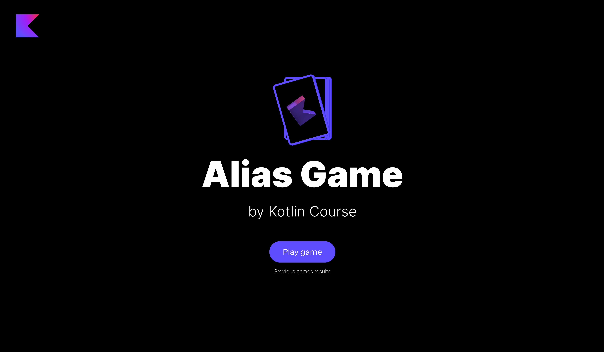

### Task

It's time to revive the cards. The package `jetbrains.kotlin.course.alias.card` already has the regular class `CardService`.
You just need to add several properties and implement several methods:

- Add a property `identifierFactory` with the type `IdentifierFactory` to generate identifiers for each card.
  Don't forget to add the default value for it (just create a new instance of the `IdentifierFactory` class).
- Add a property `cards` that stores a list of cards (`List<Card>`), you should initialize it by calling
  the `generateCards` method.
- Add a companion object into the `CardService` class and declare the `WORDS_IN_CARD` const variable to store the number
  of words for the cards.
  You need to assign the value `4` to it. Also, declare `cardsAmount` here, which stores the possible number of
  cards: `words.size / WORDS_IN_CARD`.
  The project contains a predefined list of words `words`.
- Implement the `toWords` function from the `CardService` class, which is an extension function for `List<String>`
  and converts each element from this list into `Word`.
- Implement the `generateCards` function, which shuffles the `words` list, splits it into chunks with `WORDS_IN_CARD` words
  each,
  takes `cardsAmount` chunks for `cardsAmount` cards, and finally creates a new `Card` for each chunk.
- Implement the `getCardByIndex` method, which accepts `index` (an integer number) and returns the `Card` at this index.
  It is better to throw an error if the card does not exist to explain what happened to the user.

After finishing this task you will be able to play the game:



If you have any difficulties, **hints will help you solve this task**.

----

### Hints

<div class="hint" title="Click me to learn what a list of words looks like">

The project contains a predefined list of words `words`. It is just a set of possible words that are used in the game:
```kotlin
val words = setOf(
    "cable",
    "curve",
    "substance",
    ...
)
```
</div>


<div class="hint" title="Click me to learn about the `shuffled` built-in function">

Sometimes, you need to randomly shuffle the contents of a list: for example,
to change the order of the words in the original list.
To do this, you can either generate different word positions from the original list and build a new list
or use the built-in function [`shuffled`](https://kotlinlang.org/api/latest/jvm/stdlib/kotlin.collections/shuffled.html):

  ```kotlin
  val numbers = listOf(1, 2, 3, 4, 5, 6)
  println(numbers.shuffled()) // 1, 2, 3, 4, 5, 6 in a different random order
  ```
</div>

<div class="hint" title="Click me to learn about the `chunked` built-in function">

Sometimes, you need to split a list into `N` sublists of the same length:
for example, when you want a large list of words split into sublists for each game card.
To do this, you can manually iterate every `N` elements and create a new sublist,
but you can also use the built-in function [`chunked`](https://kotlinlang.org/docs/collection-parts.html#chunked):

  ```kotlin
  val numbers = listOf(1, 2, 3, 4, 5, 6)
  println(numbers.chunked(2)) // [[1, 2], [3, 4], [5, 6]]
  ```
</div>

<div class="hint" title="Click me to learn about the `take` built-in function">

Sometimes, you need to take the first `N` elements from a list.
To do that, you can either loop up to the `N`th element and make a new list
or use the built-in function [`take`](https://kotlinlang.org/api/latest/jvm/stdlib/kotlin.collections/take.html).

  ```kotlin
  val numbers = listOf(1, 2, 3, 4, 5, 6)
  println(numbers.take(4)) // [1, 2, 3, 4]
  ```
</div>

<div class="hint" title="Click me to learn how to chain multiple function calls">

In Kotlin, you don't need to create a new variable for each function call
if you're working with collections, such as a list.
You can call them sequentially, thus creating a chain of calls:

  ```kotlin
  val numbers = listOf(1, 2, 3, 4, 5, 6)
  val chunkedList = numbers.chunked(2)
  println(chunkedList.take(2)) // [[1, 2], [3, 4]]
  ```

It is the **same** as

  ```kotlin
  val numbers = listOf(1, 2, 3, 4, 5, 6)
  println(numbers.chunked(2).take(2)) // [[1, 2], [3, 4]]
  ```
</div>

<div class="hint" title="Click me to learn about the `map` and `forEach` built-in functions">

If you need to handle each element in a collection, such as a list or a map,
you can use the built-in `forEach` or `map` functions instead of the `for` loop.
In this case, you need to write the action inside curly brackets.

The main difference between `forEach` and `map` is the return value.
If you use the `map` function, you **will get** a new collection, e.g., a list with transformed values, and you can continue the sequence of calls.
If you use the `forEach` function, you **will not get** a new collection:

  ```kotlin
  val numbers = listOf(1, 2, 3, 4, 5, 6)
  for (number in numbers) {
    println(number)
  }
  ```
It is the **same** as:
  ```kotlin
  val numbers = listOf(1, 2, 3, 4, 5, 6)
  numbers.forEach { println(it) }
  ```

However, if you use the `map` function, the behaviour will be different:
  ```kotlin
  val numbers = listOf(1, 2, 3, 4, 5, 6)
  val squared = numbers.map { 
    println(it) 
    it * it
  } // [1, 4, 9, 16, 25, 36]
  ```

In the latter case, the initial list `[1, 2, 3, 4]` will be printed, and next, each number in this list will be squared.
The result of the last action inside the curly brackets will appear in the final list.

You can also combine `map` with other functions:
  ```kotlin
  val numbers = listOf(1, 2, 3, 4, 5, 6)
  println(numbers.take(3).map { it * it }) // [1, 4, 9]
  ```
</div>

<div class="hint" title="Click me to learn about the `getOrNull` built-in function">

If you try to get an element from a list by an index that does not exist, you will get an error.
To avoid that, you can use the built-in function [`getOrNull`](https://kotlinlang.org/api/latest/jvm/stdlib/kotlin.collections/get-or-null.html), which returns the value or `null` if the index does not exist:

  ```kotlin
  val numbers = listOf(1, 2, 3, 4)
  println(numbers[10]) // Throws the index out of bounds error

  println(numbers.getOrNull(10) ?: error("You use incorrect index 10 for the list")) // This is better because the error message will provide the user with detailed information about the error
  ```
</div>
