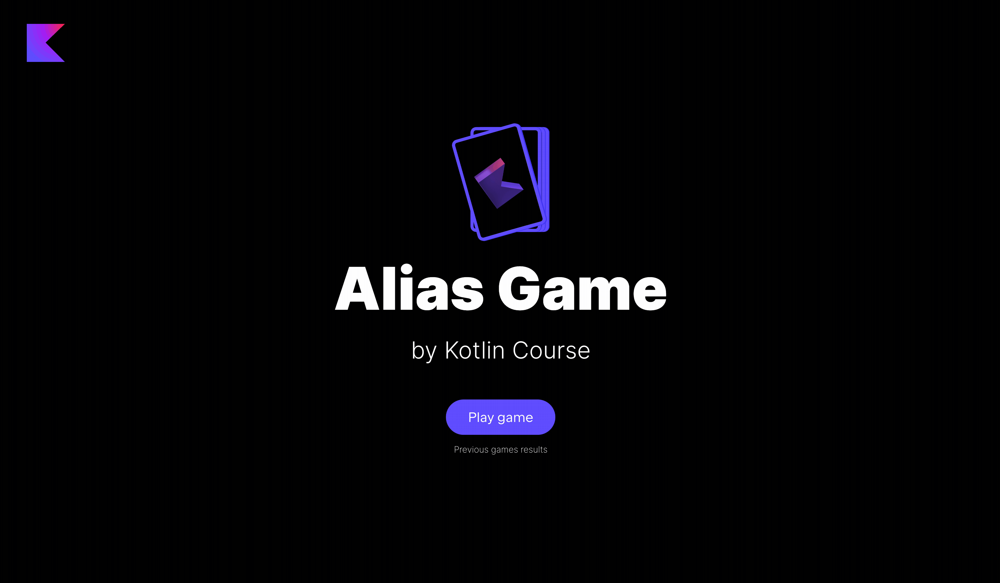

Congratulations! Your game is almost ready – it remains only to add the display of the leaderboard at the end of the game
and store the results for the previous rounds.
In this task, you will implement several things in the already defined class `GameResultsService` in
the `jetbrains.kotlin.course.alias.results` package:

- add a type alias `GameResult` to `List<Team>`;
- add a companion object into the `GameResultsService`
  and declare the `gameHistory` variable to store the list of game results (`MutableList<GameResult>`).
  By default, it must be initialized via an empty list.
- implement the `saveGameResults` method that adds the `result` into the `gameHistory`.
  Before adding the `result`, you need to check two requirements and throw an error if they are broken: 1) `result` must
  be not empty; 2) all team ids from the `result` must be present in the `TeamService.teamsStorage`.
- implement the `getAllGameResults` method that returns the reversed `gameHistory` list.

<div class="hint" title="Click me if you pressed Check and found a compilation error">

  If you have a compilation error and you have not solved this step yet, please solve the task and try again. 
  It is expected behavior, since the code requires the type alias `GameResult`, but it does not exist.
</div>

Hooray! After finishing this step, the game will work well:



<div class="hint" title="Click me to learn about possible ways to extend the project">

Congratulations! You did a great job and created a working application. 
We have put together a few ideas on how you can further improve this project on your own. 
These improvements will not be tested within the course. 
Some enhancements require changes to both the client (what is displayed in the browser) 
and the server (the application logic). 
We don't cover the client-server architecture in this course, 
so you can either explore that on your own or implement ideas that don't require investigating third-party code.

**Server improvements:**

- Currently, the application throws an error if something goes wrong:
  for example, the application throws an error if the list with words for new cards becomes empty.
  As an improvement, you can add handling of this kind of error.
- You can add categories for the words on the card, such as animals, 
  countries, or movies to make the game process more diverse. 
  At the beginning of the game, you can generate a random category as the default option.
- Currently, we lose the game progress if we turn off the server.
  You can implement the ability to save the current state of the game in files,
  and when the server is starting, you can extract this data.

**Client improvements:**

- Error handling can be added not only on the server but also on the client side: 
  for example, you may show a dialog window with the error message.
- Word categories can be added not only on the server, but also on the client side:
  for example, you may add a new screen to choose the category.
- You can add a list of forbidden words, which cannot be used while describing the word on the card. 
  For this improvement on the client side, you need to display such a list of words.
</div>


If you have any difficulties, **hints will help you solve this task**.

----

### Hints

<div class="hint" title="Click me to learn about the `isNotEmpty` built-in function">

If you need to check that a list is not empty, you can check its size or use the built-in [isNotEmpty](https://kotlinlang.org/api/latest/jvm/stdlib/kotlin.collections/is-not-empty.html) function:

  ```kotlin
  val numbers = listOf(1, 2, 3)
  if (numbers.size != 0) {
      TODO()
  }
  ```
It is the **same** as

  ```kotlin
  val numbers = listOf(1, 2, 3)
  if (numbers.isNotEmpty()) {
      TODO()
  }
  ```
</div>

<div class="hint" title="Click me to learn about `contains` and `in`">

In Kotlin, you can use [operators](https://kotlinlang.org/docs/java-interop.html#operators) insted of several functions to make code shorter.
For example, instead of the `contains` function, you can use the `in` operator to check if the collection contains a certain element:

  ```kotlin
  val numbers = listOf(1, 2, 3, 4)
  println(numbers.contains(1)) // true
  ```
It is the **same** as
  ```kotlin
  val numbers = listOf(1, 2, 3, 4)
  println(1 in numbers) // true
  ```
</div>


<div class="hint" title="Click me to learn about the `all` built-in function">

If you need to check that **all** elements match the given predicate, you can use the built-in [`all`](https://kotlinlang.org/api/latest/jvm/stdlib/kotlin.collections/all.html) function.
You need to put the predicate in curly brackets:

  ```kotlin
  val evenNumbers = listOf(2, 4, 6)
  println(evenNumbers.all { it % 2 == 0 }) // true
  println(evenNumbers.all { it == 4 }) // false because only one item satisfies the predicate
  ```
</div>

<div class="hint" title="Click me to learn about the `reversed` built-in function">

If you need to get a list in which the elements are in reverse order,
you can either loop through the elements of the original list from the end to the beginning and
return a new list or use the built-in [`reversed`](https://kotlinlang.org/api/latest/jvm/stdlib/kotlin.collections/reversed.html) function:

  ```kotlin
  val numbers = listOf(1, 2, 3, 4)
  val reversedList = mutableListOf<Int>()
  for (i in numbers.size - 1 downTo 0) {
    reversedList.add(numbers[i])
  }
  println(reversedList) // [4, 3, 2, 1]
  ```

It is the **same** as
  ```kotlin
  val numbers = listOf(1, 2, 3, 4)
  val reversedList = numbers.reversed()
  println(reversedList) // [4, 3, 2, 1]
  ```
</div>
