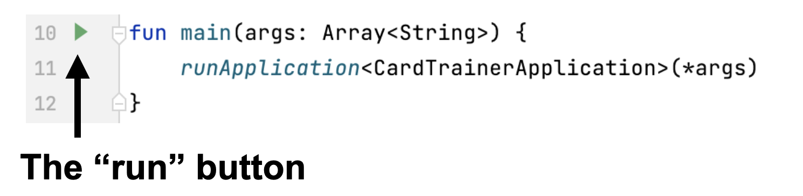
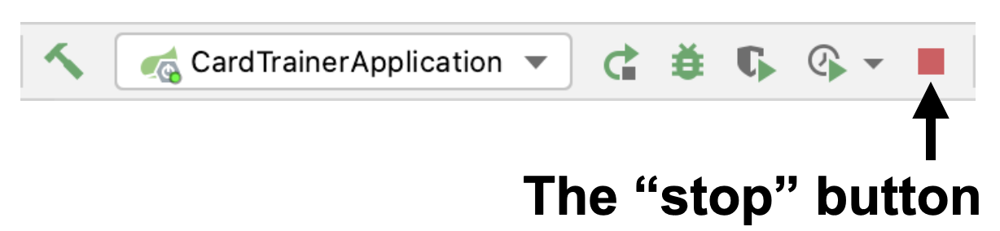
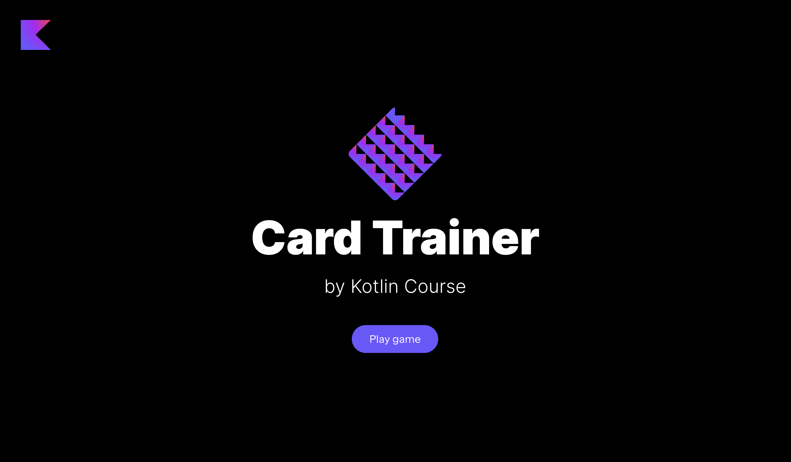

At each stage, you can run the current version of the application. 
However, if some functionality is not yet ready, 
then some buttons may not work, and some information may not be displayed.

To run the application you need to run the `main` function inside 
the [CardTrainerApplication.kt](./src/main/kotlin/jetbrains/kotlin/course/card/trainer/CardTrainerApplication.kt) file:

Please, don't forget to _stop all other runs_ by pressing the red square button:

Next you need to open any browser (we recommend to use [Google Chrome](https://www.google.com/chrome/) to display elements as in the examples) 
and open http://localhost:8080/. You will see the main page of the application:

