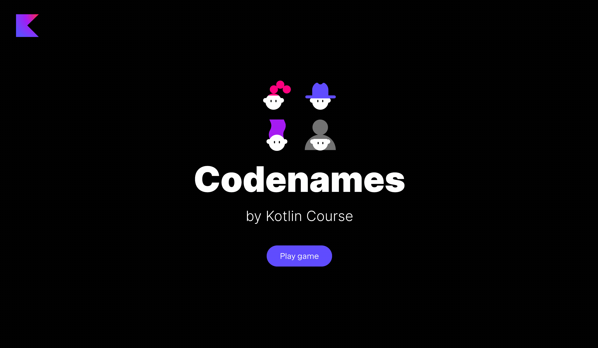

### Project description

The project of this lesson is **Codenames**.
Most probably everyone knows this party board game.
In this game, the players are split into two teams.
Each team chooses a leader 
and tries to guess all the words of its team color in fewer attempts than the other team.

You can read the detailed rules in [Wikipedia](https://en.wikipedia.org/wiki/Codenames_(board_game)).

### Lesson topics

- objects;
- initializer blocks;
- enum classes;
- functional interfaces (Single Abstract Method, SAM);
- interfaces and inheritance;
- some built-in functions to handle errors and work with collections.

### Project example

By the end of this task, you will create the following game:

