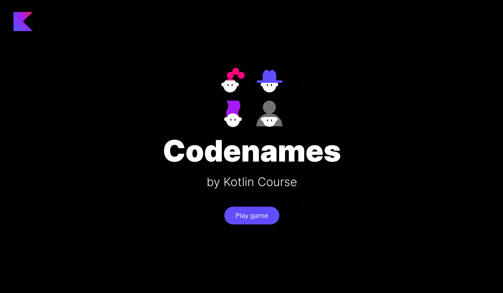

The package `jetbrains.kotlin.course.codenames.keyCard` already has the regular class `KeyCardService`.
It is responsible for the game logic for the key card. 
In this task, you need to implement the `generateKeyCard` function to make the game alive:

- Implement the `generateKeyCard` function, which returns a new instance of the `KeyCard` class.

After finishing this task, you will be able to see the generated `KeyCard`, but the game field will not be generated yet:

If you have any difficulties, **hints will help you solve this task**.

----

### Hints

You just need to create a new instance of the `KeyCard` class: `KeyCard()`. 
Since it already has a default value for the `cells` field, 
you can omit the arguments.

