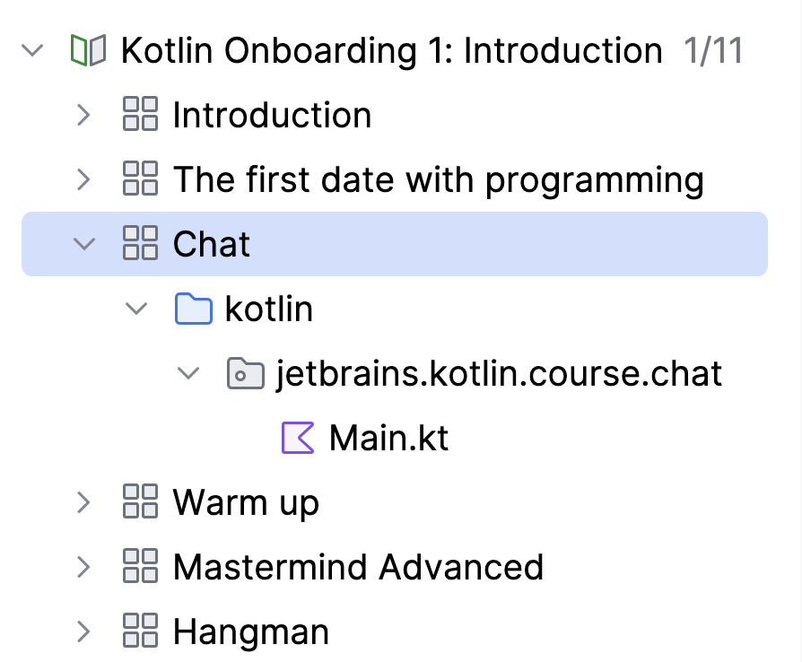

## Course View

The **Course View** displays the course syllabus: a structured list of lessons and tasks.

You can navigate to any task by double-clicking its name.

To hide the Course View window, click the Project Tool Window button or press &shortcut:ActivateProjectToolWindow;. This provides more space for the Editor and Task Description windows.

To restore the Course View window, simply click the Project Tool Window button (or press &shortcut:ActivateProjectToolWindow;) again.
