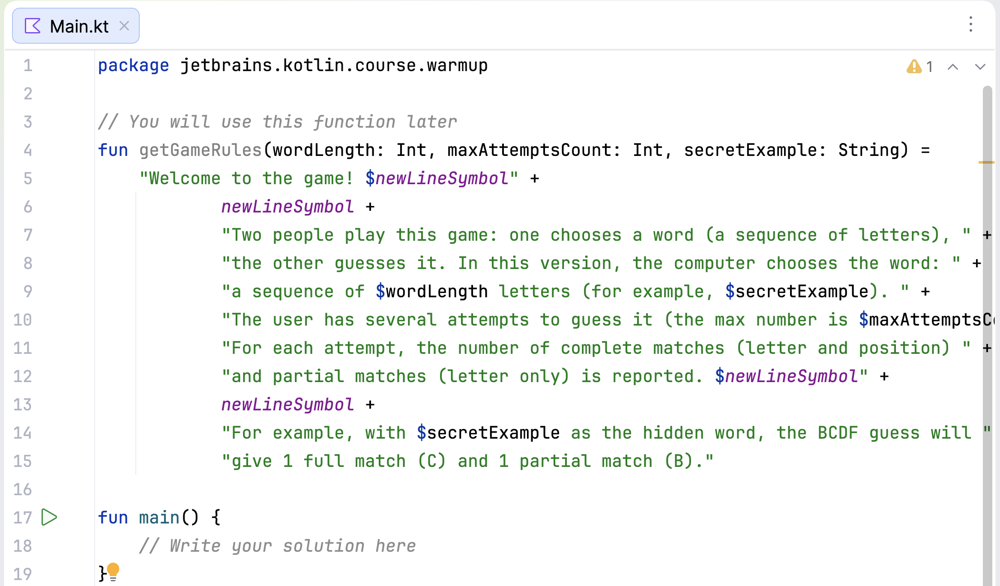

## Editor

The **Editor** is your playground for programming. You can use it to experiment with code while working on theoretical tasks and quizzes, as these changes are not checked.

For programming assignments, use the Editor to modify existing code or write your own from scratch. This code will be checked when you submit your solution.

To run your code at any time, select **Run** from the context menu, press &shortcut:Run; or click .

To go back to the Editor and focus on your code, use the **Hide All Windows** command (&shortcut:HideAllWindows;). To restore your previous layout, simply repeat the command.

