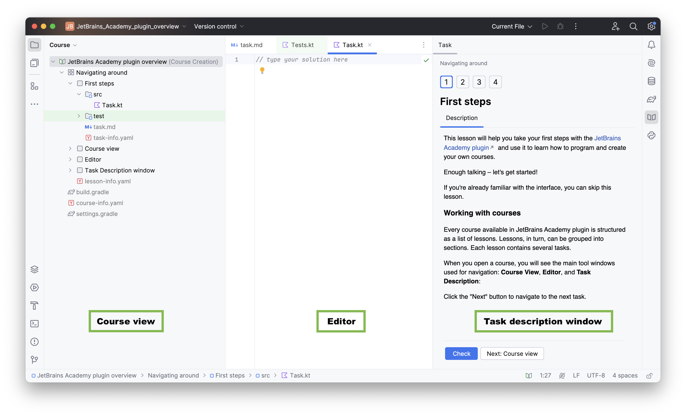

## JetBrains Academy plugin overview

This lesson will help you take your first steps with the [JetBrains Academy plugin](https://www.jetbrains.com/help/education/educational-products.html) and show you how to use it to learn Kotlin.

With the JetBrains Academy plugin, you can learn programming languages and tools by completing coding tasks and receiving instant feedback right inside your IDE.

Enough talking – let's get started!

If you're already familiar with the interface, feel free to skip this lesson.

### Working with courses
Every course available in the JetBrains Academy plugin is structured as a list of lessons. Lessons, in turn, can be grouped into sections, and each lesson contains several tasks.

When you open a course, you will see the primary tool windows used for navigation: **Course View**, **Editor**, and **Task Description**:

Click the "Next" button to navigate to the next task.