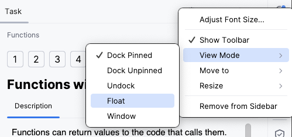
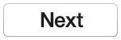
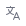

## Task Description

The **Task Description** window is where you read what each task asks you to do. It contains the theory, the step-by-step instructions, code examples, images, and hints you need to complete your work.

When you are ready to submit a programming assignment, press the **Check** button. For theory tasks and quizzes, press the **Next** button  to continue.

To move between tasks manually, use the navigation arrows:  goes to the previous task and  goes to the next one.

If you want to start a task again from scratch, use **Reset task** . If you get stuck, you can look at a reference answer with **Peek solution** . Both actions are available from the  menu.

The toolbar also lets you interact with the course: leave a question or report a problem on a task with **Comment** , switch the language of the task text with **Translation** , and share your opinion about the course with **Rate the course** .

To free up space for the Editor, hide this window with . You can always bring it back the same way.