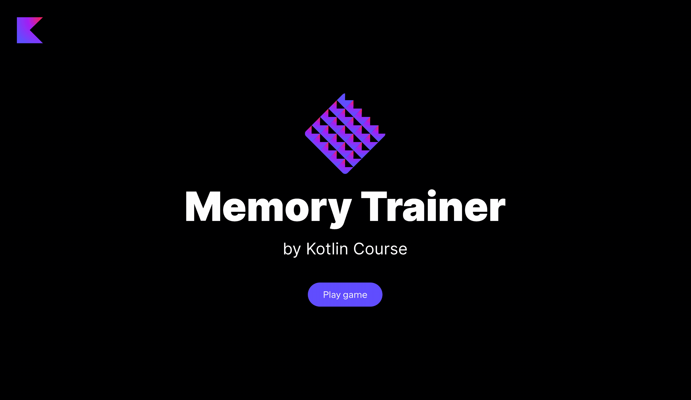

This lesson focuses on the topics covered in the previous lesson.
The main difference is that this lesson does not contain a theory part –
you just need to implement the project from scratch by yourself.
We have no doubt that you will succeed!

----

### Project description

The project of this lesson is **Memory Trainer**.
This application will allow you to train your memory and memorize countries and their capitals.

### Project example

At the end of this task, you will create the following application:

