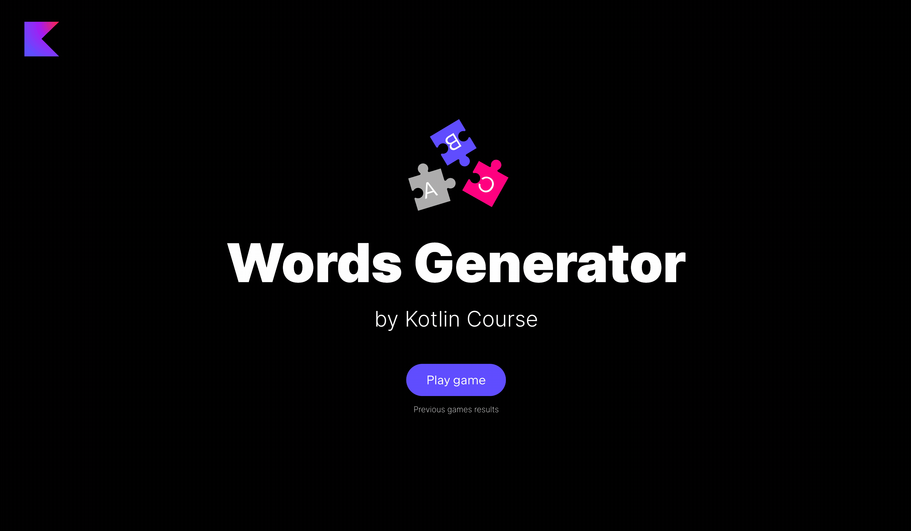

This lesson focuses on the topics covered in the previous lesson.
The main difference is that this lesson does not contain a theory part –
you just need to implement the project from scratch by yourself.
We have no doubt that you will succeed!

----

### Project description

The project of this lesson is **Word Generator**.
In this game, you need to divide into teams and build new words from the characters of one long English word.

### Project example

By the end of this task, you will create the following game:

