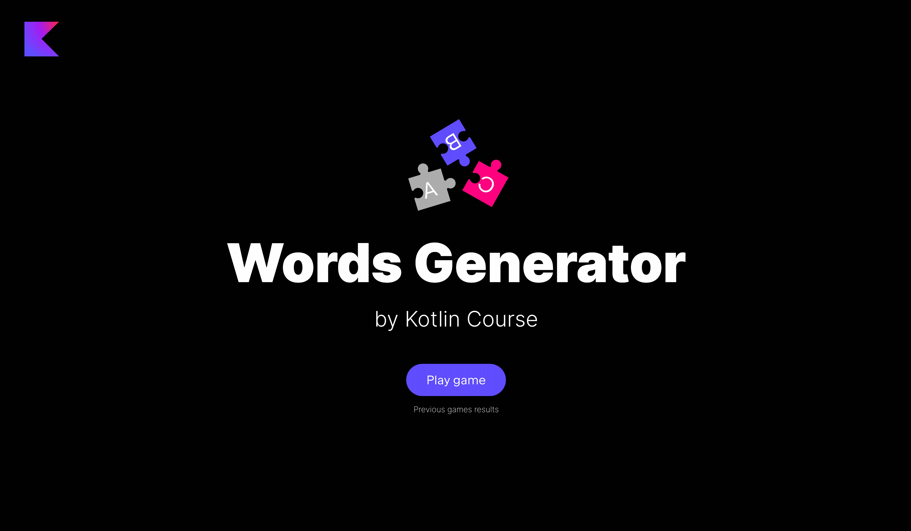

The **goal** of this step is to add validators to the `WordService` class.

Find the already added `WordService` class in the `jetbrains.kotlin.course.words.generator.word` package and modify it.

- Implement the `isValidWord` function, that checks if the received word can be built by the long word:

  - If `newWord` (the word inputted by the user) _is empty_, return `false`.
  - If `newWord` contains symbols not present in `keyWord`, return `false`.
  - Note, the number of times some symbol occurs in `newWord` cannot be grater
    than the number of times this symbol occurs in `keyWord`.
  ```kotlin
  val a = service.isValidWord("photothermoelasticity", "") // false
  val b = service.isValidWord("photothermoelasticity", "dog") // false
  val c = service.isValidWord("photothermoelasticity", "photo") // true
  val d = service.isValidWord("photothermoelasticity", "photooooo") // false because the initial word contains two <o> symbols
  val e = service.isValidWord("photothermoelasticity", "pilot") // true
  ```

- Add an internal variable `previousWords` to the companion object in this class with the type `MutableMap<String, MutableList<Word>>`,
  which maps each game word to the list of already guessed words. Don't forget to init this map as an empty map.
- Implement the `isNewWord` function:

  - If `previousWords` does not contain `keyWord` yet, put the `keyWord` into the `previousWords` map together with `newWord` and return `true`.
  - If the list of words `previousWords[keyWord]` contains `newWord`, return `false`; else, add `newWord` into the map and return `true`.


After solving this step, the game will be almost done:



If you have any difficulties, **hints will help you solve this task**.

----

### Hints

<div class="hint" title="Click me to learn about the `isEmpty` built-in function">

You can also use the `isEmpty` function with strings, not only with lists:

  ```kotlin
  fun main() {
    println("".isEmpty()) // true
    println("cat".isEmpty()) // false
  }
  ```
</div>

<div class="hint" title="Click me to learn about the built-in aggregation functions">

Kotlin has a lot of built-in functions for aggregation; consider several of those that can help you solve this task.
You can use [`groupingBy`](https://kotlinlang.org/api/latest/jvm/stdlib/kotlin.collections/grouping-by.html) to group the word by its letters
and then use [`eachCount`](https://kotlinlang.org/api/latest/jvm/stdlib/kotlin.collections/each-count.html) to count the occurrences of each letter:

  ```kotlin
  fun main() {
    val word = "photothermoelasticity"
    val grouped = word.groupingBy { it }.eachCount() // returns a map
    println(grouped) // {p=1, h=2, o=3, t=4, e=2, r=1, m=1, l=1, a=1, s=1, i=2, c=1, y=1}
  }
  ```

These functions work with a special [Grouping](https://kotlinlang.org/api/latest/jvm/stdlib/kotlin.collections/-grouping/) representation, which we will consider in detail in the third module of this course.
</div>

<div class="hint" title="Click me to learn about the `all` built-in function">

If you need a verification that **all** elements match the given predicate, you can use the built-in [`all`](https://kotlinlang.org/api/latest/jvm/stdlib/kotlin.collections/all.html) function.
You need to enclose the predicate in curly brackets:

  ```kotlin
  val evenNumbers = listOf(2, 4, 6)
  println(evenNumbers.all { it % 2 == 0 }) // true
  println(evenNumbers.all { it == 4 }) // false because only one item satisfies the predicate
  ```
</div>

<div class="hint" title="Click me to learn about the putIfAbsent built-in function">

When working with a `map`, you can use the built-in `putIfAbsent` function to add a new value if it is not present in the `map`:
  ```kotlin
  val myMap = mutableMapOf<Int, String>()
  if (1 !in myMap.keys) {
      myMap[1] = "one"
  }
  ```
It is the **same** as:
  ```kotlin
  val myMap = mutableMapOf<Int, String>()
  myMap.putIfAbsent(1, "one")
  ```
</div>

<div class="hint" title="Click me to learn about `contains` and `in`">

In Kotlin, you can use [operators](https://kotlinlang.org/docs/java-interop.html#operators) insted of certain functions to make code shorter.
For example, instead of using the `contains` function, you can use the `in` operator to check if a collection contains a specific element:

  ```kotlin
  val numbers = listOf(1, 2, 3, 4)
  println(numbers.contains(1)) // true
  ```
It is the **same** as
  ```kotlin
  val numbers = listOf(1, 2, 3, 4)
  println(1 in numbers) // true
  ```
</div>
